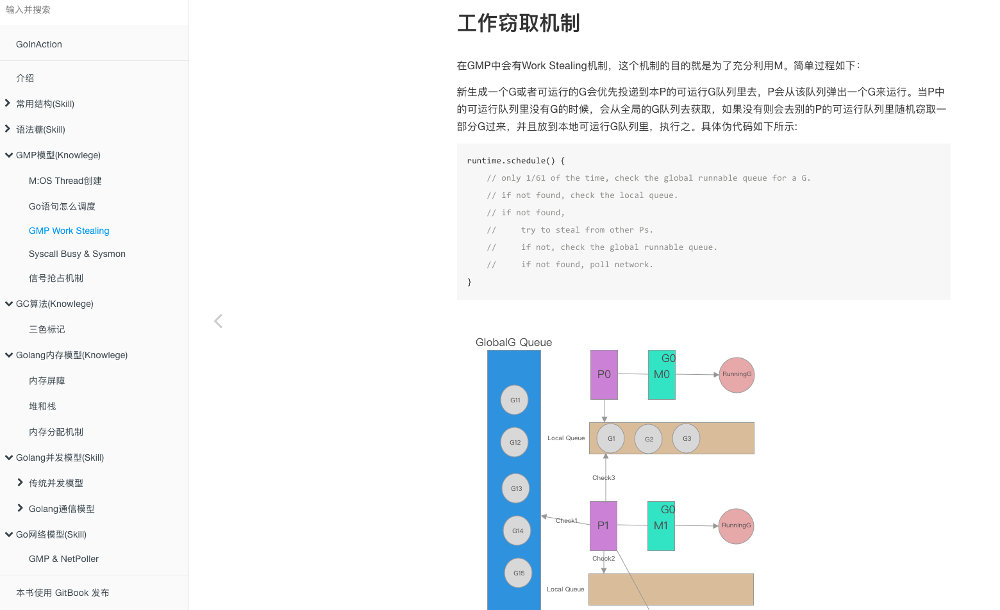
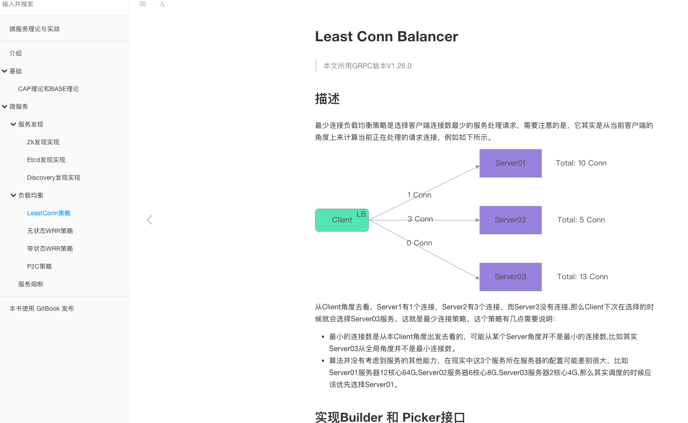

## 自我感受

作为一个Phper/Pythoner，而且我司项目还没上微服务，所以刚开始感觉会跟不上节奏。不过后来学下来，慢慢开始对微服务和Golang有感觉。

老师的课程包括很多的内容，Golang底层，微服务，架构实例等等，每个部分都有很大的帮助，都是干货，不过对我而言吸收确实需要花一段时间。经过一段时间的听课，感觉老师上课也是很有技巧，总会把复杂的问题说得让我们明白。除了上面这些实打实的干货知识，另外一部分感受比较深的是老师的学习论，就是作为一个工程师怎样去刻意精进和对技术的态度。还有很多他平时用的可以提高效率的工具，都是无私的教授给我们，老师一定是花了很多心思去准备这门课的。

其实听了前面几节课，我发现很多东西在课上是听懂了，但是真正去用不知道如何去做，比如微服务。后来意识到这个问题，我就开始去刻意总结，并且简单做一些练习来巩固所学。

## 方法调整

我刻意总结的方法很简单，就是把老师上课的内容，课后不看视频，再重新整理和回想一遍，然后组成了一个gitbook。这样其实不单单能把老师说的加强理解，而且能把其他老师觉得没必要说的也补充进去，让自己对这块知识点更加有映象。

当然说和整理很重要，另外还需要去刻意的写一些相关代码。代码主要分为两个方面：1）基础库类型的代码，这部分就是对上课内容的实践，老师说的很多地方都经过优化，有些都是他们厂的一些技术精华，当然有部分已经被打包开源出来，比如Kratos，对于这部分可以直接参考和模仿。2）具体项目类型的代码，这个部分老师在课上也有分析，比如播放历史，弹幕，评论等等系统的设计，这部分最好的方法还是去做一遍。

整个理解到实践有很多内容还没有消化，后面还需要花一些时间，这个过程是不断迭代和成长的过程，也是工作的一部分。

## 对工作的帮助

工作中目前没有全部用到这些内容，但是我相信今后肯定用的到。就像老师说的，应该站在BAT的角度去考虑问题，这样才能有更高的技术视角，做出好的服务为公司盈利，同时自己也能快速提高。

## 毕业只是新的开始

虽然这只是一个线上的教学，但是毕业并不意味着学习的结束，对我而言，却是刚刚开始。近期的目标还是会把老师说的关于微服务和Golang的知识整理一下，然后看下自己有什么短板，或者到更大的平台提升一下自己。

**总之，这次学习之旅很愉快，物超所值，感谢毛大，感谢所有教职员，谢谢!**